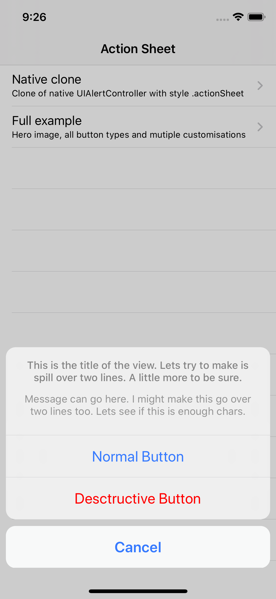
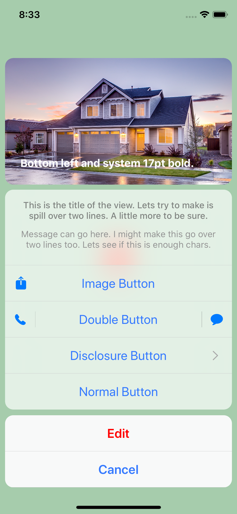

# ActionSheet

<p align="center">


</p>

<p align="center">

[](https://cocoapods.org/pods/ActionSheet)
[](https://cocoapods.org/pods/ActionSheet)
[](https://cocoapods.org/pods/ActionSheet)

</p>

## Example

To run the example project, clone the repo, and run `pod install` from the Example directory first.

## Requirements

ActionSheet requires iOS 10 or later

## Installation

ActionSheet is available through [CocoaPods](https://cocoapods.org). To install
it, simply add the following line to your Podfile:

```ruby
pod 'ActionSheet'
```

## Author

William Connelly, connelly.william@gmail.com

## License

ActionSheet is available under the MIT license. See the LICENSE file for more info.
